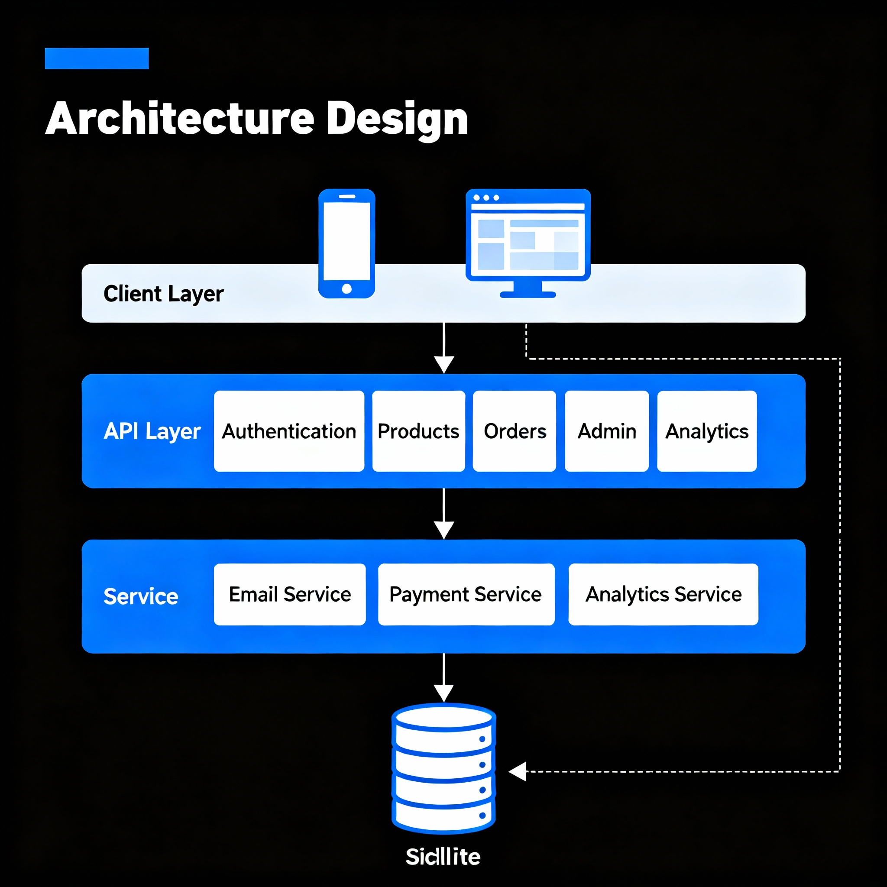

# FastAPI Pet Store API



A simple, production-ready FastAPI backend for a pet food store. It includes authentication, products, orders, subscriptions, coupons, admin dashboards, and analytics.

## Quick Start

- Python 3.11 recommended
- Install dependencies:
  - `pip install -r requirements.txt`
- Run locally:
  - `python -m uvicorn app.main:app --reload --port 8000`
- Open API docs:
  - `http://localhost:8000/docs`

## Configuration

- Environment file: `.env`
- Key variables:
  - `DATABASE_URL` (default SQLite: `sqlite:///app.db`)
  - `SECRET_KEY` (JWT signing)
  - `PASSWORD_SCHEMES` (e.g., `pbkdf2_sha256,bcrypt`)

## Tech Stack

- FastAPI `0.115.0`
- SQLAlchemy ORM
- Alembic migrations
- SQLite (local dev)

## Project Structure

```
d:\trae project\fastapi-pet/
├── .env
├── alembic.ini
├── alembic/
│   ├── env.py
│   ├── script.py.mako
│   └── versions/
│       └── 3668b57523a4_init.py
├── app.db
├── app/
│   ├── main.py
│   ├── database.py
│   ├── models.py
│   ├── schemas.py
│   ├── auth/
│   │   ├── jwt_handler.py
│   │   └── routes.py
│   ├── routers/
│   │   ├── products.py
│   │   ├── users.py
│   │   ├── orders.py
│   │   ├── pets.py
│   │   ├── payments.py
│   │   ├── subscriptions.py
│   │   ├── coupons.py
│   │   ├── admin.py
│   │   └── analytics.py
│   ├── services/
│   │   ├── email_service.py
│   │   ├── payment_service.py
│   │   └── analytics_service.py
│   ├── tests/
│   │   ├── test_auth.py
│   │   └── test_products.py
│   └── utils.py
├── requirements.txt
├── scripts/
│   └── set_admin.py
└── test.db
```

## Core Endpoints

- Auth
  - `POST /auth/register` — Register user
  - `POST /auth/login` — Login, returns JWT
- Products
  - `POST /products/` — Create product (admin)
  - `GET /products/` — List products
  - `GET /products/{id}` — Get product
  - `PUT /products/{id}` — Update product (admin)
  - `DELETE /products/{id}` — Delete product (admin)
- Orders
  - `POST /orders/` — Create order (user)
- Admin
  - `GET /admin/notifications/low-stock` — Low stock products

## Admin Setup (Local)

- Elevate a user to admin:
  - `python scripts/set_admin.py admin@example.com`
- Then login and use admin-only endpoints with `Authorization: Bearer <token>`.

## Example: Create & Show Product

- Login as admin and create a product using Swagger at `http://localhost:8000/docs` → `POST /products/`.
- Minimal JSON body:
```
{
  "slug": "chicken-meal-001",
  "name": "Chicken Meal",
  "price": 19.99,
  "stock": 12,
  "species_tags": ["dog"],
  "subscription_available": true
}
```
- Show product: `GET /products/{id}`

## Image Notes

- Replace the placeholder architecture image with your own file:
  - Add an image (e.g., `docs/architecture.png`).
  - Update the Markdown at the top:
    - ``

## Testing

- Run tests: `python -m pytest -q`

## License

- MIT